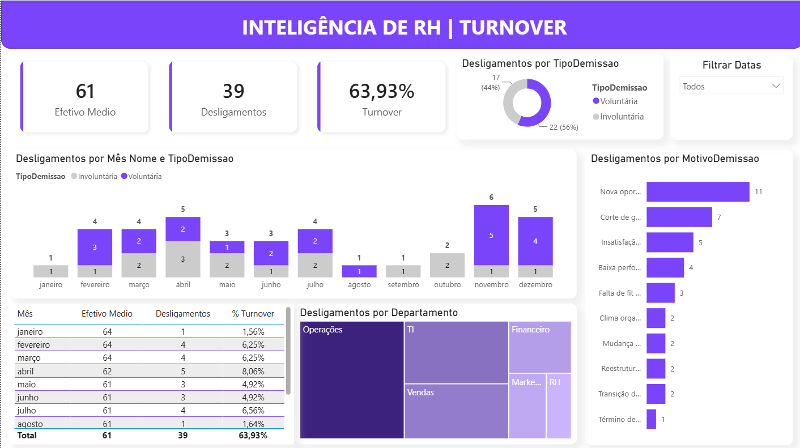
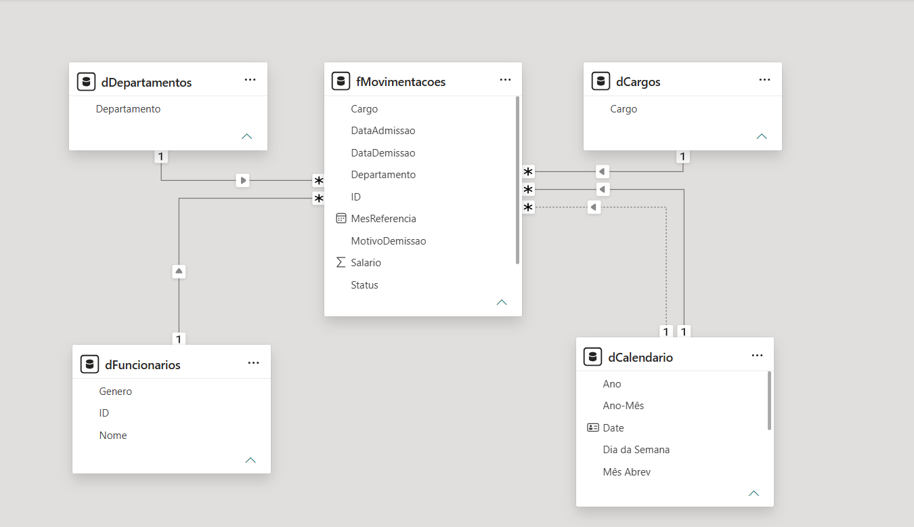

# Inteligência de RH | Dashboard de Turnover

Este projeto é uma solução completa de Business Intelligence orientada para People Analytics (Inteligência de RH). O objetivo central é analisar o fluxo de colaboradores (admissões e demissões), fornecendo métricas precisas sobre o Headcount (Efetivo Médio) e a Taxa de Turnover da empresa, permitindo a identificação de padrões por departamento, cargo e motivos de saída.

O projeto foi desenvolvido aplicando as melhores práticas de mercado para modelação de dados, ETL e cálculos DAX, garantindo um dashboard rápido, escalável e à prova de erros de contagem.

---

## 🛠️ Tecnologias e Ferramentas Utilizadas

* **Power BI:** Ferramenta principal para modelação, cálculos e visualização de dados.
* **Power Query:** Utilizado para a etapa de ETL (Extração, Transformação e Limpeza).
* **DAX (Data Analysis Expressions):** Linguagem utilizada para a criação de medidas complexas e inteligência de tempo.
* **Python (Pandas):** Utilizado inicialmente para a geração de uma base de dados sintética de 100 linhas a simular um cenário real de RH.

---

## ⚙️ Arquitetura e Metodologia de BI

A construção deste dashboard seguiu o padrão de excelência de desenvolvimento em Business Intelligence:

* **ETL e Staging Area:** O tratamento de dados foi feito no Power Query, focando na tipologia correta (especialmente moedas e datas). Os valores nulos em colunas de texto foram tratados, enquanto os nulos nas colunas de `DataDemissao` foram estrategicamente mantidos para não distorcer os cálculos de tempo. Foi implementada uma *Staging Area* para gerir as referências de tabelas de forma limpa e evitar quebras de consultas.
* **Modelação Dimensional (Star Schema):** A base de dados foi estruturada no modelo Estrela. A base original foi dividida em dimensões de contexto e uma tabela de factos (acontecimentos):
  * `dCalendario` (Tabela de datas criada via DAX)
  * `dDepartamentos`
  * `dCargos`
  * `dFuncionarios`
  * `fMovimentacoes` (Tabela de Factos)
* **Relacionamentos Avançados:** O filtro cruzado foi configurado como estritamente Único (Unidirecional) para evitar loops e lentidão no modelo. O grande diferencial técnico é a ligação da Tabela de Factos com a `dCalendario` utilizando duas linhas: uma relação ativa com a `DataAdmissao` e uma relação inativa com a `DataDemissao`.
* **Inteligência de Tempo (DAX):** A relação inativa é "despertada" dinamicamente via DAX através da função `USERELATIONSHIP`, permitindo que o mesmo filtro de calendário analise as entradas e saídas de forma independente.

---

## 📊 Principais Métricas e Visuais (KPIs)

As medidas foram organizadas numa tabela dedicada (`_Medidas`) para facilitar a manutenção. Os principais indicadores incluem:

* **Efetivo Médio (Headcount):** Cálculo dinâmico de quantos colaboradores estavam ativos na empresa num período específico, ignorando o contexto de filtro padrão do calendário para validar datas de entrada e saída simultaneamente.
* **Desligamentos:** Contagem precisa de saídas ativando o relacionamento inativo de datas.
* **Taxa de Turnover (%):** Divisão segura e tratada entre o total de desligamentos e o efetivo médio.
* **Visuais:** O painel conta com cartões de resumo (Cards), mapa de árvore (Treemap) para análise departamental, gráficos de barras a categorizar desligamentos por motivos e evolução mensal, além de um gráfico de rosca a segmentar as saídas voluntárias e involuntárias.

---

## 🖥️ Visualização do Dashboard

[Clique aqui para acessar o Dashboard](https://app.powerbi.com/view?r=eyJrIjoiOWYyZmFiZDctZGYxYy00MDE1LTgwYTUtZWQxOWVhNTBlYmM1IiwidCI6IjBkNjMzMGFiLWRiZTktNDhjMC05NjhiLTU4NTlhNDI5ZGQwOCJ9)
> 
> 

---

## 🚀 Acesso ao Projeto

Pode explorar os ficheiros e a estrutura deste projeto clonando o repositório ou descarregando os ficheiros diretamente:

1. **Base de Dados Fictícia:** O ficheiro `Base_Turnover_Atualizada.csv` contendo a massa de dados gerada via Python está disponível na pasta principal.
2. **Dashboard Interativo:** Faça o download do ficheiro `Turnover_Dashboard.pbix`.
3. **Como testar:** Abra o ficheiro `.pbix` no **Power BI Desktop**. Navegue pelos separadores, interaja com os filtros dinâmicos de tempo/departamento e explore o modelo de dados e as medidas DAX construídas.
